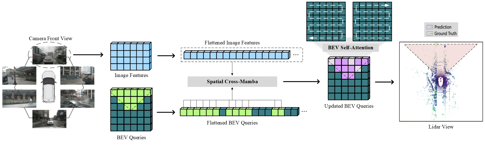
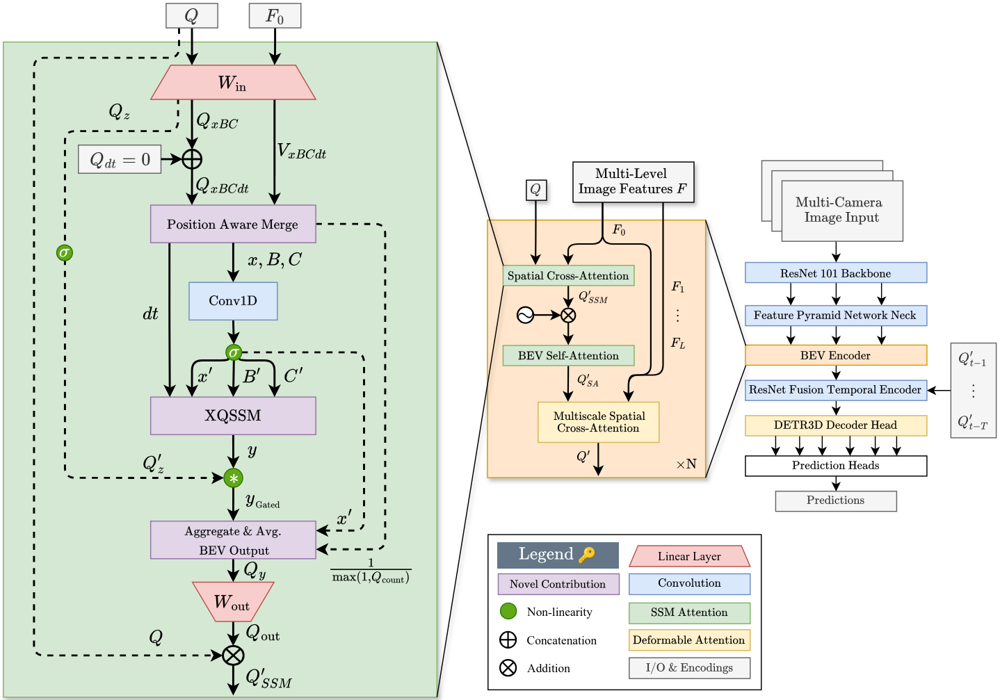

<div align="center">   
  
# MamBEV:Enabling State Space Models to Learn Birds-Eye-View Representations

> **MamBEV: Enabling State Space Models to Learn Birds-Eye-View Representations**, ICLR 2025,
> **[Paper](https://arxiv.org/abs/2503.13858)**
</div>


# Abstract
3D visual perception tasks, such as 3D detection from multi-camera images, are essential components of autonomous driving and assistance systems. However, designing computationally efficient methods remains a significant challenge. In this paper, we propose a Mamba-based framework called MamBEV, which learns unified Bird’s Eye View (BEV) representations using linear spatio-temporal SSM-based attention. This approach supports multiple 3D perception tasks with significantly improved computational and memory efficiency. Furthermore, we introduce SSM based cross-attention, analogous to standard cross attention, where BEV query representations can interact with relevant image features. Extensive experiments demonstrate MamBEV’s promising performance across diverse visual perception metrics, highlighting its advantages in input scaling efficiency compared to existing benchmark models.


# Overall Architecture



# Getting Started
- [Installation](docs/install.md) 
- [Prepare Dataset](docs/prepare_dataset.md)
- [Run and Eval](docs/getting_started.md)

# Model Zoo

| Backbone | Method | Lr Schd | NDS| mAP|memory | Config | Download |
| :---: | :---: | :---: | :---: | :---:|:---:| :---: | :---: |
| [R50](https://drive.google.com/file/d/1JTVcrFcOFdPp7rtZ6K__SfF0Np15vXL7/view?usp=sharing) | MamBEV-tiny | 24ep | 39.9|26.6 | - |[config](projects/MAMBEV/configs/MamBEV/mambev_tiny_t3.py) |[model]/[log] |
| [R101-DCN](https://github.com/zhiqi-li/storage/releases/download/v1.0/r101_dcn_fcos3d_pretrain.pth)  | MamBEV-small | 24ep | 52.5| 42.2 | - |[config](projects/MAMBEV/configs/MamBEV/mambev_small_t3.py)|[model](https://drive.google.com/drive/folders/1-MXxszU80aSG4P1_hQnC0qlQOHnPb4iM?usp=drive_link)/[log] |

# Catalog
- [ ] MamBEV-Base
- [ ] MamBEV Optimization, including memory, speed, inference.
- [x] MamBEV-Small and Tiny Release 
- [ ] 3D Detection checkpoints
- [x] 3D Detection code
- [x] Backbones


# Support Us

If you find this work useful, please consider:

- Starring the repository 
- Citing our paper 
- Contributing to the codebase 

# Bibtex
If this work is helpful for your research, please consider citing the following BibTeX entry.

```
@inproceedings{ke2025mambev,
  title={MamBEV: Enabling State Space Models to Learn Birds-Eye-View Representations},
  author={Ke, Hongyu and Morris, Jack and Oguchi, Kentaro and Cao, Xiaofei and Liu, Yongkang and Wang, Haoxin and Ding, Yi},
  booktitle={The Thirteenth International Conference on Learning Representations},
  year={2025}
}
```

# Acknowledgement

Built on the shoulders of giants. Many thanks to these excellent open source projects:
- [dd3d](https://github.com/TRI-ML/dd3d) 
- [detr3d](https://github.com/WangYueFt/detr3d) 
- [mmdet3d](https://github.com/open-mmlab/mmdetection3d)
- [bevformer](https://github.com/fundamentalvision/BEVFormer)
- [mamba-ssm](https://github.com/state-spaces/mamba)
- [hydra](https://github.com/goombalab/hydra?tab=readme-ov-file) 
